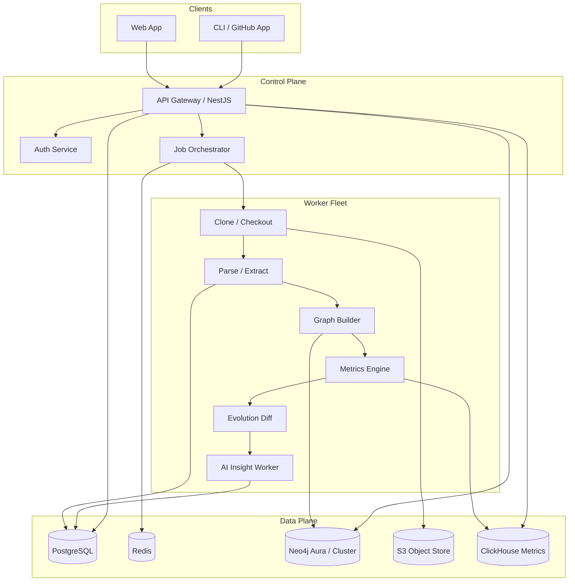
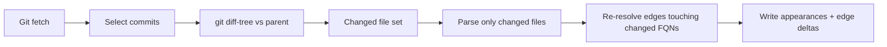
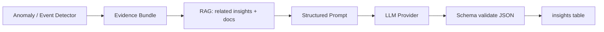

# Git With It — Engineering Implementation Plan

## 1. Overall Architecture

**Pattern: Modular monolith + async worker fleet** (not microservices on day one).

A single deployable API/control plane owns auth, repo metadata, job orchestration, and query APIs. Heavy work (clone, parse, graph build, metrics, AI) runs in horizontally scaled workers behind a job queue. Services are *logical* bounded contexts inside one monorepo so a small team ships fast, with clear extraction seams later.



**Bounded contexts**

| Context | Responsibility |
|---|---|
| Identity & Tenancy | Users, orgs, SSO, RBAC |
| Repository Ingestion | Clone, sync, commit walk, sparse checkout |
| Symbol Extraction | Language parsers, FQN identity, SCIP/LSIF optional |
| Knowledge Graph | Snapshot nodes/edges, temporal identity, diffs |
| Metrics | Time-series architectural metrics |
| Evolution | Structural change detection, timeline events |
| Insights | Prompt assembly, LLM calls, insight persistence |
| Visualization API | Graph slices, heatmaps, compare payloads |
| Billing / Quotas | Seat/repo limits, analysis minutes |

**Core invariant:** Analysis is append-only and replayable. Re-running a commit range with the same parser version must produce deterministic entity IDs and metrics (versioned by `analyzer_version`).

---

## 2. Recommended Technology Stack

| Layer | Choice | Role |
|---|---|---|
| Language (API) | **TypeScript (NestJS)** | Control plane, GraphQL/REST, auth, tenancy |
| Language (workers) | **Rust** (hot path) + **TypeScript** (orchestration glue) | Parse/extract/graph/metrics at scale |
| Parsers | **tree-sitter** (+ language grammars) | Multi-language AST extraction |
| Optional precision | SCIP / LSIF (Go, Java, TS via scip-* indexers) | High-fidelity call graphs when available |
| Primary DB | **PostgreSQL 16** | Tenancy, jobs, entities, insights, audit |
| Graph DB | **Neo4j 5** (Aura or self-hosted cluster) | Traversal, patterns, cycle detection |
| Metrics store | **ClickHouse** | Historical metrics, heatmaps, aggregates |
| Object storage | **S3-compatible** (R2/S3/MinIO) | Bare clones, parse artifacts, SCIP indexes |
| Queue | **Redis + BullMQ** (MVP) → **NATS JetStream** or **Temporal** (scale) | Job orchestration |
| Cache | **Redis** | Query cache, rate limits, session |
| Search (later) | **OpenSearch** | Full-text over symbols/insights |
| AI | **Anthropic Claude / OpenAI** via abstraction + **embeddings** in PG (`pgvector`) | Insights, RAG |
| Frontend | **Next.js 15 (App Router) + React** | Product UI |
| Graph viz | **Cytoscape.js** or **Sigma.js / Graphology** | Interactive graphs |
| Charts | **Apache ECharts** or **Observable Plot** | Metrics timelines |
| Auth | **Clerk** or **Auth.js + Postgres** | MVP auth; enterprise SSO later |
| Infra | **Kubernetes** (EKS/GKE) + Terraform | Prod; Docker Compose for local |
| Observability | OpenTelemetry → Grafana / Tempo / Loki | Traces, metrics, logs |
| Monorepo | **pnpm workspaces + Turborepo**; Rust via Cargo workspace | Unified DX |

---

## 3. Why Each Technology Was Chosen

**NestJS (TS) for control plane** — Strong DI, modular boundaries, GraphQL+REST, large hiring pool. Matches frontend language; shared types via monorepo packages.

**Rust workers for analysis** — Parsing millions of files and building graphs is CPU/memory bound. Rust + tree-sitter gives predictable latency, low RAM vs Node/Python, and safe concurrency. TypeScript workers remain for AI prompt assembly and lighter jobs.

**tree-sitter over full language compilers** — Compilers (javac, rustc, tsc) are accurate but slow, environment-heavy, and fragile in CI-like sandboxes. tree-sitter is fast, offline, multi-language, and good enough for structural architecture graphs. SCIP is an *upgrade path* for call-graph precision on supported languages, not a day-one dependency.

**Neo4j for graph** — Mature Cypher, APOC, GDS (PageRank, Louvain communities, cycle algorithms), strong visualization ecosystem. Memgraph is faster for pure streaming but weaker ecosystem; Neptune locks you in. Neo4j wins for product velocity + algorithms.

**PostgreSQL as system of record** — Entity registry, job state, tenancy, and insight documents live in PG. Neo4j is a *derived* projection optimized for traversal — never the only source of truth.

**ClickHouse for metrics** — Billions of metric points (entity × commit × metric type) destroy Postgres. ClickHouse columnar aggregates (p95 complexity by package over time) are the right tool.

**S3 for clones/artifacts** — Bare repos and parse caches are large binary blobs; keep them out of databases.

**BullMQ → Temporal** — MVP: Redis/BullMQ is simple. At scale (retries, saga, long-running repo analyses spanning hours), migrate orchestration to **Temporal** for durable workflows, heartbeats, and cancellation.

**Cytoscape/Sigma** — Browser cannot render 100k-node graphs. Server returns *slices* (ego networks, package-level collapse). Sigma/WebGL handles ~10k nodes; Cytoscape is stronger for interaction/plugins. Recommend **Sigma.js + Graphology** for perf, with server-side aggregation.

---

## 4. Database Design (PostgreSQL)

**Core tables (simplified conceptual model)**

- `organizations`, `users`, `memberships`, `api_keys`
- `repositories` — remote URL, default branch, visibility, last synced SHA, clone URI in S3
- `analysis_runs` — repo_id, from_sha, to_sha, status, analyzer_version, stats JSON
- `commits` — repo_id, sha, parent_shas[], authored_at, message, tree_hash
- `entities` — stable identity across time (see §9)
- `entity_appearances` — entity_id, commit_sha, file_path, content_hash, loc, kind
- `graph_snapshots` — commit_sha, node_count, edge_count, storage_pointer, status
- `graph_deltas` — from_sha, to_sha, added/removed/modified counts, artifact URI
- `evolution_events` — typed architectural timeline events
- `insights` — AI-generated, linked to run/commit range/entity
- `jobs` / outbox — if not fully in Redis/Temporal
- `parser_versions`, `feature_flags`, `quotas`

**Indexes:** `(repo_id, sha)`, `(entity_id, commit_sha)`, GIN on commit parents, BRIN on `authored_at` for large histories.

**Partitioning:** `entity_appearances` and `commits` by `repo_id` hash or time; large customers get dedicated partitions.

---

## 5. Graph Schema (Neo4j)

**Node labels**

`Repository`, `Package`, `File`, `Module`, `Class`, `Interface`, `Enum`, `Method`, `Function`, `Variable`, `Import`, `Endpoint`, `DbModel`, `Test`, `Layer` (inferred)

**Shared node properties**

```
id: string          // stable entity UUID from Postgres
fqn: string         // fully qualified name
kind: string
repo_id: string
name: string
language: string
```

**Temporal strategy (critical):** Do **not** create a full Neo4j copy per commit. Use **versioned edges + presence intervals** (see §7).

**Relationship types**

`CONTAINS`, `DEFINES`, `IMPORTS`, `CALLS`, `EXTENDS`, `IMPLEMENTS`, `REFERENCES`, `READS`, `WRITES`, `DEPENDS_ON`, `TESTS`, `CREATES`, `MODIFIES`, `ROUTES_TO` (endpoint→handler)

**Relationship properties**

```
valid_from: long    // commit topological index or timestamp
valid_to: long      // exclusive; null/MAX = current
added_in: string    // sha
removed_in: string? // sha
weight: float       // call count / strength
analyzer_version: string
```

**Constraints:** uniqueness on `(repo_id, id)` for nodes; composite indexes on `fqn`, `kind`, edge `valid_from`/`valid_to`.

---

## 6. Entity Model

**Canonical entity kinds** map 1:1 to graph labels. Domain object in code:

```
Entity {
  id: UUID                    // stable across commits
  repoId: UUID
  kind: EntityKind
  fqn: string                 // primary identity key within repo+kind
  language: string
  firstSeenCommit: Sha
  lastSeenCommit: Sha
  status: active | deleted | renamed
  renameOf: UUID?             // chain for renames
  metadata: JSON              // language-specific
}
```

**Appearance (per commit):** path, start/end line, content_hash, metrics blob pointer, visibility (public/private).

**Aggregates:** `Package` and `Layer` are derived entities — built from path conventions + import graph clustering, stored explicitly after inference so the UI can query them.

---

## 7. Graph Storage Strategy

**Problem:** Full graph × N commits is economically and operationally impossible at scale (e.g. 50k nodes × 200k edges × 5k commits).

**Recommended hybrid: Entity Registry (Postgres) + Temporal Graph (Neo4j) + Snapshot Checkpoints (S3) + Delta Log**

1. **Postgres `entities` / `entity_appearances`** — authoritative identity and presence.
2. **Neo4j temporal edges** — each edge has `[valid_from, valid_to)`. Nodes exist once; presence of a node at commit C is either a `PRESENT_IN` edge with validity or a join to Postgres appearances for exact file binding.
3. **Checkpoints every K commits** (e.g. K=50 or every release tag) — serialize adjacency list (or GraphML/Parquet) to S3 for fast “materialize graph at SHA”.
4. **Delta log** between commits — compact added/removed edges + node create/delete/rename for evolution UI and replay.

**Materialize-at-SHA algorithm**

- Load nearest checkpoint ≤ SHA  
- Apply deltas forward to target SHA  
- Or Cypher filter: edges where `valid_from <= idx(SHA) < valid_to`

**Tradeoff vs alternatives**

| Approach | Pros | Cons | Verdict |
|---|---|---|---|
| Full graph per commit | Simple queries | Storage explosion | Reject |
| Only latest graph | Cheap | No evolution product | Reject |
| Pure property-graph temporal | Elegant queries | Heavy writes; Neo4j size | Accept as primary query model |
| Checkpoint + delta only | Cheap storage | Slower arbitrary SHA | Use as backup/cold path |
| **Hybrid (chosen)** | Queryable + bounded cost | More moving parts | **Recommend** |

**Package-level rollup graphs** always stored for UI defaults; file/symbol graphs loaded on expand.

---

## 8. Incremental Parsing Strategy



**Rules**

1. Prefer **bare clone** + `git cat-file` / partial clone; avoid full working-tree checkout per commit when possible.
2. For each commit, compute changed paths vs first-parent (configurable; merge commits: first-parent policy for architecture timelines).
3. Re-parse only added/modified files; deleted files → close appearances / close edges.
4. **Invalidate dependents:** if file A changes exports, re-resolve import/call edges for files that imported A (reverse index from prior snapshot).
5. Cache parse trees by `(path, blob_oid)` in S3/RocksDB — blob content-addressed; identical file across commits = cache hit.
6. **Sampler modes for MVP scale control:** every commit | every Nth | only tagged releases | density adaptive (more samples when churn high).
7. Analyzer version bump → mark runs stale; background reanalyze from checkpoints.

**Language pack plugin API:** each language implements `extract(blob) -> Symbols + UnresolvedRefs`; a shared **linker** resolves refs to FQNs using import maps.

---

## 9. Entity Identity Strategy Across Commits

**Primary key:** `repo_id + kind + fqn` (normalized).

**FQN examples**

- TS: `src/payments/PaymentService.ts::PaymentService#charge`
- Java: `com.acme.payments.PaymentService#charge(Order)`
- Python: `payments.service.PaymentService.charge`

**Stability tactics**

1. **Exact FQN match** across consecutive commits → same `entity.id`.
2. **Git rename detection** (`git diff -M`) → path rename maps FQNs with updated path prefix; keep same UUID, record `rename` event.
3. **Content hash + signature match** when FQN changes (move type): same kind, similar signature, high token similarity (Jaccard on normalized AST) → likely rename; threshold + human-correctable later.
4. **Split/merge:** one entity → many = close old + birth new with `derived_from` links; do not force single identity.
5. **Never use line numbers or file path alone** as identity.

**Commit index:** maintain monotonic `topo_index` per repo (first-parent order) for temporal edge bounds — more reliable than timestamps alone (clock skew, rebases).

---

## 10. Graph Diff Algorithm

**Input:** graphs (or delta-applied materializations) at SHA_A and SHA_B.

**Steps**

1. Align entities by stable `id` (and rename chains).
2. **Node diff:** added / removed / persisted; classify persisted as metric-changed vs unchanged.
3. **Edge diff:** key = `(from_id, type, to_id)`; added / removed / weight-changed.
4. **Structural features:**
   - New SCCs / cycles (Tarjan on package graph)
   - Coupling delta: Δ(fan-in/out), Δ(dependency count)
   - Layer violation deltas (rules engine)
   - Community membership change (Louvain on package graph)
5. **Summarize into Evolution Events** with severity scores (rules + statistical outliers).

**Output artifact**

```
GraphDiff {
  from, to,
  nodes: { added, removed, renamed },
  edges: { added, removed, reweighted },
  metrics_delta: [...],
  events: [ EvolutionEvent ],
  highlight_subgraph: NodeId[]  // for UI animation
}
```

Precompute diffs for consecutive sampled commits; on-demand for arbitrary pairs (bounded: refuse if |commits| too large without checkpoints).

---

## 11. Repository Processing Pipeline

**Workflow (Temporal/BullMQ saga)**

1. **Register** repo → validate URL/permissions  
2. **Clone/Fetch** → bare repo to PVC/S3  
3. **Enumerate commits** (first-parent, sample policy) → write `commits`  
4. **For each commit (parallelism with depth limit):**
   - Resolve blobs for changed files  
   - Parse + extract  
   - Link references  
   - Upsert entities/appearances  
   - Emit edge deltas → Neo4j writer  
   - Compute file/entity metrics → ClickHouse  
5. **Every K commits:** checkpoint graph to S3  
6. **Evolution pass:** consecutive diffs → events  
7. **AI pass:** select notable events + metric anomalies → insights  
8. **Mark run ready** → invalidate caches → webhook/notify  

**Isolation:** each job runs in a sandbox with CPU/memory/time limits; untrusted repo code is **never executed** — parse only.

**Backpressure:** global concurrency per org; large repos auto-downgrade to tag/sample density.

---

## 12. AI Pipeline

**Principle:** Metrics and diffs are truth; LLMs narrate and rank, never invent graph facts.



**Evidence bundle** includes: entity FQNs, metric time series snippets, top edge diffs, file churn, blame hotspots (optional), prior insights.

**Prompt outputs (JSON schema):** headline, narrative, severity, category (`debt|drift|risk|refactor`), entity_ids[], confidence, suggested_actions[].

**Models:** cheap model for bulk summarization; strong model for high-severity/org-critical repos. Embeddings of insights + FQNs in `pgvector` for “similar past incidents.”

**Guardrails:** refuse if evidence empty; cite metric numbers from bundle only; store `model`, `prompt_hash`, `evidence_hash` for audit.

---

## 13. Backend Architecture

**NestJS modules:** `AuthModule`, `ReposModule`, `ReposModule`, `AnalysisModule`, `GraphQueryModule`, `MetricsModule`, `InsightsModule`, `BillingModule`, `AdminModule`.

**Workers (Rust crates):** `gwi-git`, `gwi-parse`, `gwi-link`, `gwi-graph`, `gwi-metrics`, `gwi-diff`; thin TS workers for AI and GitHub webhooks.

**API styles:** REST for CRUD; **GraphQL** for UI aggregation; internal gRPC/HTTP between orchestrator and Rust binaries (spawn as sidecar or subprocess with JSONL protocol for MVP).

**AuthZ:** org-scoped RBAC; row-level `org_id` on all queries.

**Idempotency:** jobs keyed by `(repo_id, analyzer_version, commit_sha, stage)`.

---

## 14. Frontend Architecture

**Next.js App Router** with route groups:

- Marketing / docs  
- App shell: org switcher, repo list, analysis status  
- Repo views: Overview, Timeline, Graph, Metrics, Insights, Compare  

**State:** TanStack Query for server state; URL as source of truth for `sha`, `compare`, selected node.

**Visualization strategy**

- Default: **package-level** graph  
- Expand node → fetch ego network (depth 1–2, capped degree)  
- Compare mode: overlay added (green) / removed (red) edges  
- Heatmap mode: node color = metric at SHA  
- Animation: tween between two materialized layouts (precomputed layout positions stored per checkpoint)

**Design system:** internal component library; dark engineering aesthetic is fine if intentional — avoid generic “AI purple” chrome; prioritize graph readability (colorblind-safe palettes).

---

## 15. API Design

**REST (examples)**

- `POST /v1/repos` — connect repo  
- `POST /v1/repos/:id/analyze` — start/resume run  
- `GET /v1/repos/:id/runs/:runId` — status  
- `GET /v1/repos/:id/commits` — sampled commits  
- `GET /v1/repos/:id/graph?sha=&view=package|symbol&focus=&depth=`  
- `GET /v1/repos/:id/graph/diff?from=&to=`  
- `GET /v1/repos/:id/metrics?entity=&names=&from=&to=`  
- `GET /v1/repos/:id/timeline` — evolution events  
- `GET /v1/repos/:id/insights`  
- `POST /v1/repos/:id/compare`  

**GraphQL** for nested UI: `repository { timeline { events } insights { ... } entity(id) { metrics history } }`.

**Webhooks:** `analysis.completed`, `insight.created`.

**Versioning:** `/v1`; analyzer_version separate from API version.

---

## 16. Job Processing

**MVP:** BullMQ queues — `clone`, `parse`, `graph_write`, `metrics`, `evolve`, `ai`, `maintenance`.

**Job payload:** small (IDs + SHAs); large artifacts in S3.

**Policies:** exponential backoff, dead-letter, per-org concurrency, progress heartbeats (`commits_done/total`), cancellation cooperative.

**Scale path:** Temporal workflows with activities mapping 1:1 to stages; child workflows per commit-batch shards.

**Priority:** interactive reanalyze of tip > historical backfill.

---

## 17. Caching

| Cache | Key | TTL |
|---|---|---|
| Graph slice | `graph:{repo}:{sha}:{view}:{focus}:{depth}` | short + invalidate on run complete |
| Metrics series | `metrics:{repo}:{entity}:{metric}:{range}` | medium |
| Materialized SHA | memory/local SSD near Neo4j workers | session |
| Parse blob | `blob:{oid}` content-addressed | permanent |
| LLM | `insight:{evidence_hash}` | permanent dedupe |

Redis for hot; CDN for static marketing; HTTP cache headers on public demo graphs only.

---

## 18. Scalability Considerations

- **Horizontal workers** by queue; pin Neo4j writers to limited concurrency (single-writer per repo to avoid edge races).  
- **Shard by repo_id** for multi-tenant Neo4j (database-per-large-customer or label+property partitioning).  
- **Sample density** auto-tunes to finish SLA (e.g. first insight in &lt;30 min for 500k LOC).  
- **Package rollups** for default UX; symbol graphs on demand.  
- **Cold storage:** age out fine-grained edges older than N months to S3; keep package graph + metrics forever.  
- **Read replicas:** PG + ClickHouse; Neo4j read replicas for query API.  
- **Target envelopes:** 5M LOC, 200k files, 10k sampled commits — design load tests around these.

---

## 19. Monorepo Structure

```
git-with-it/
  apps/
    web/                 # Next.js
    api/                 # NestJS
    worker-ts/           # AI, webhooks, light jobs
    marketing/           # optional
  crates/                # Rust
    gwi-git/
    gwi-parse/
    gwi-link/
    gwi-graph/
    gwi-metrics/
    gwi-diff/
    gwi-cli/             # local analysis CLI
  packages/
    shared-types/
    api-client/
    eslint-config/
    tsconfig/
  infra/
    terraform/
    k8s/
    docker-compose.yml
  docs/
    architecture/
    adr/                 # Architecture Decision Records
  tooling/
    scripts/
```

---

## 20. Folder Structure (API / Web detail)

```
apps/api/src/
  modules/{auth,repos,analysis,graph,metrics,insights,billing}/
  common/{guards,interceptors,telemetry}/
  jobs/

apps/web/src/
  app/(app)/[org]/[repo]/{overview,graph,timeline,metrics,insights,compare}/
  components/{graph,charts,timeline}/
  lib/{api,auth}/

crates/gwi-parse/src/
  languages/{typescript,python,java,go,csharp}/
  extract/
  model/
```

---

## 21. Development Roadmap

**Phase 0 — Foundations (2–3 weeks)**  
Monorepo, Compose (PG, Redis, Neo4j, MinIO, ClickHouse), auth stub, repo CRUD, bare clone worker.

**Phase 1 — Parse + Identity (3–4 weeks)**  
tree-sitter for TS/JS + Python; entity registry; blob cache; single-SHA graph in Neo4j.

**Phase 2 — Evolution MVP (3–4 weeks)**  
Commit sampling, incremental parse, edge deltas, graph diff API, basic timeline events.

**Phase 3 — Metrics + UI (3 weeks)**  
ClickHouse metrics, complexity/coupling/cycles, Next.js graph + timeline + metrics charts.

**Phase 4 — AI Insights (2–3 weeks)**  
Anomaly detection, evidence bundles, LLM insights, insight feed UI.

**Phase 5 — Hardening (ongoing)**  
More languages, SCIP optional, Temporal migration, multi-tenant isolation, billing.

---

## 22. MVP Definition

**In scope**

- Connect public GitHub repo (PAT) or upload remote URL  
- Analyze default branch with **sampled commits** (e.g. last 100 + monthly anchors)  
- Languages: **TypeScript/JavaScript + Python**  
- Package + file dependency graph at a SHA  
- Compare two SHAs with highlighted edge changes  
- Metrics: file size, fan-in/out, import cycles (package), simple complexity proxy  
- Timeline of structural events (deps added/removed, new cycles)  
- 5–10 AI insights per run  
- Single-tenant orgs, email auth  

**Out of scope for MVP**

- Full symbol call graphs for all languages  
- Live IDE extension  
- PR review bot  
- Autofix refactors  
- On-prem enterprise  
- Exact historical graph for every commit  

**MVP success metric:** User understands *how architecture changed* in 10 minutes without reading git log.

---

## 23. Stretch Goals

- GitHub App PR comments (“this PR increases coupling to DB layer by 12%”)  
- VS Code / Cursor extension (GitLens-like architectural lens)  
- God-object / hotspot prediction models  
- Architecture fitness functions as code (user-defined rules)  
- Multi-branch / fork comparison  
- Auto layer detection + violation alerts  
- Natural language graph query (“show everything that depends on PaymentService”)  
- SBOM + supply-chain risk overlay  
- Team ownership (CODEOWNERS) × complexity heatmaps  

---

## 24. Risks and Difficult Engineering Problems

1. **Identity across refactors** — renames/moves will mis-attribute history; invest early in rename chains + confidence scores.  
2. **Call-graph precision without compilers** — tree-sitter misses dynamic calls; product must label confidence and offer SCIP upgrade.  
3. **Neo4j write amplification** — temporal edges + large repos; mitigate with package rollups, batched writers, checkpoints.  
4. **Analysis cost / time** — users expect GitHub speed; sampling + progressive delivery (tip first, history later) is mandatory.  
5. **Untrusted repos** — parse-only sandbox, size limits, secret scanning on clones.  
6. **LLM hallucination** — strict evidence grounding and schema validation.  
7. **Monorepos (Bazel/Nx)** — path-based package inference will be wrong; need project-graph adapters.  
8. **Merge-commit topology** — first-parent simplifies product narrative but hides branch architecture; document the policy.  

---

## 25. Testing Strategy

- **Unit:** FQN normalization, diff math, metric formulas, rename matcher  
- **Golden fixtures:** small repos with known graphs per language (`testdata/repos/*`)  
- **Property tests:** diff(A,B) inverse ≈ diff(B,A) for edges; replay deltas = checkpoint materialization  
- **Integration:** Compose-based pipeline on fixture repo end-to-end  
- **Load:** synthetic 100k-file repo; measure parse throughput and Neo4j write rates  
- **AI eval harness:** fixed evidence bundles → snapshot graded narratives (toxicity, groundedness)  
- **Contract tests:** OpenAPI/GraphQL schema in CI  

---

## 26. Deployment Strategy

**Environments:** local Compose → staging → prod (multi-AZ).

**Kubernetes:** deployments for `api`, `web`, `worker-ts`, `worker-rust` (Jobs/Deployments), managed PG, Redis, Neo4j Aura or operators, ClickHouse operator, S3.

**CI/CD:** GitHub Actions — lint/test/build images, migrate PG, deploy via Helm/ArgoCD.

**Secrets:** cloud KMS + external secrets operator.

**DR:** PG PITR, Neo4j backups, S3 versioning; analysis is recomputable so graph is regenerable from git + artifacts.

**Progressive analysis SLA:** tip SHA ready before full history.

---

## 27. Future Enterprise Features

- SSO (SAML/OIDC), SCIM, audit logs  
- On-prem / VPC / air-gapped appliance  
- Data residency controls  
- RBAC to repo + branch; private insight redaction  
- Custom architecture rules / fitness functions  
- Jira/Linear integration for debt tickets  
- SLA-backed analysis queues  
- Portfolio view across hundreds of services  
- Compliance reports (change impact, SOX-friendly trails)  

---

## Key Architectural Decisions (locked for blueprint)

1. **Modular monolith + workers**, not microservices-first.  
2. **Hybrid temporal graph** (Neo4j validity intervals + S3 checkpoints + PG identity), not per-commit full graphs.  
3. **tree-sitter first**, SCIP optional for precision.  
4. **Postgres SoR + ClickHouse metrics + Neo4j traversal**.  
5. **Sampled first-parent history** with progressive densification.  
6. **Stable FQN identity** with rename chains.  
7. **AI narrates evidence**, never invents topology.  

This is the blueprint a team can execute from Phase 0 without re-litigating foundations.