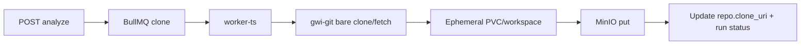

# Phase 0 — Foundations (2–3 weeks)

Parent blueprint: [Git With It Blueprint](git_with_it_blueprint_dc3c8bbe.plan.md)

**Goal:** A team can clone the monorepo, `docker compose up`, sign in, register a GitHub repo URL, and watch a job successfully bare-clone that repo into object storage — with no parsing yet.

**Exit criteria**

- Compose stack healthy: Postgres, Redis, MinIO, Neo4j (empty), ClickHouse (empty, provisioned)
- `apps/api` serves health + repo CRUD under org scope
- `apps/worker-ts` runs BullMQ `clone` jobs end-to-end
- Bare repo artifact addressable in MinIO; `repositories.last_synced_sha` / clone metadata persisted
- Shared types package compiles; Turborepo pipeline `build`/`lint`/`test` green in CI stub

---

## Scope

**In**

- Monorepo scaffold (pnpm + Turborepo + Cargo workspace stub)
- Docker Compose data plane
- NestJS API: auth stub, orgs, repos, analysis_runs stub, jobs status
- BullMQ + Redis job orchestration (clone queue only)
- Bare clone worker (git fetch into workspace → upload pack/bundle or bare dir to MinIO)
- Minimal Next.js shell: login, org, repo list, “Connect repo”, job status poll
- OpenTelemetry wiring stubs; structured logging
- ADR folder + Phase 0 ADRs for auth and clone storage format

**Out**

- tree-sitter / entity extraction
- Neo4j writes, ClickHouse metrics
- AI, graph UI, Temporal

---

## Workstreams

### 1. Monorepo and tooling

Create:

```
git-with-it/
  apps/web, apps/api, apps/worker-ts
  crates/gwi-git (stub CLI: clone/fetch only)
  packages/shared-types, eslint-config, tsconfig
  infra/docker-compose.yml, infra/terraform/ (stub)
  docs/adr/
```

- pnpm workspaces + Turborepo tasks: `dev`, `build`, `lint`, `test`
- Rust toolchain pin via `rust-toolchain.toml`; `gwi-git` callable from worker via subprocess for MVP
- Env schema via `@t3-oss/env` or zod in API/worker
- GitHub Actions: install, lint, unit tests, build images (no deploy yet)

### 2. Data plane (Compose)

Services and ports documented in `docs/architecture/local-dev.md`:

| Service | Purpose in Phase 0 |
|---|---|
| Postgres 16 | SoR: users, orgs, repos, jobs metadata |
| Redis 7 | BullMQ + session/cache stub |
| MinIO | Bare clone / git artifacts |
| Neo4j 5 | Provision only; no writes |
| ClickHouse | Provision only; no writes |

Include migrate-on-boot for Postgres (Prisma or Drizzle — **choose Drizzle** for SQL clarity and Nest fit).

### 3. Postgres schema (Phase 0 subset)

Tables:

- `organizations`, `users`, `memberships`
- `repositories` — `org_id`, `remote_url`, `default_branch`, `visibility`, `clone_uri`, `last_error`, `status`
- `analysis_runs` — `repo_id`, `status` (`queued|cloning|ready|failed`), `triggered_by`, timestamps
- `jobs` — optional mirror of BullMQ for UI (`type`, `status`, `progress`, `error`)

Migrations checked into `apps/api/drizzle/`.

### 4. Auth and tenancy

**Decision locked:** Auth.js (NextAuth) credentials/magic-link or GitHub OAuth for MVP; sessions in Postgres. Clerk deferred to reduce vendor lock in Phase 0.

- NestJS guards: `JwtOrSessionAuth`, `OrgMembershipGuard`
- All repo queries filtered by `org_id`
- Seed script: one org, one admin user

### 5. API surface (Phase 0)

- `GET /health`
- `POST /v1/orgs`, `GET /v1/orgs/:id`
- `POST /v1/repos` — body: `{ remoteUrl, defaultBranch? }`
- `GET /v1/repos`, `GET /v1/repos/:id`
- `POST /v1/repos/:id/analyze` — creates `analysis_run`, enqueues `clone` only
- `GET /v1/repos/:id/runs/:runId`

OpenAPI generated from Nest decorators.

### 6. Clone worker



Requirements:

- Support public HTTPS remotes; private via PAT stored encrypted at rest (KMS stub = env key in local)
- Timeouts, max repo size guard (e.g. reject &gt; 2GB pack for local)
- Idempotent: re-analyze reuses existing bare clone and `git fetch`
- Progress events: `cloning` → `uploading` → `ready`
- Never execute repository code

**Artifact format decision:** store as **bare git directory tar.zst** in MinIO keyed `repos/{repo_id}/bare.tar.zst` (simpler than git-bundle for incremental fetch later).

### 7. Web shell

- Routes: `/login`, `/[org]/repos`, `/[org]/repos/[repo]`
- Connect-repo form + run status polling (TanStack Query)
- No graph/metrics UI

### 8. Observability and DX

- Pino logs with `request_id`, `org_id`, `repo_id`, `job_id`
- OTel exporter optional via env
- `make up` / `pnpm dev` docs

---

## ADRs to write

1. Modular monolith + BullMQ (not Temporal yet)
2. Drizzle + Postgres as SoR
3. Bare clone tar.zst in object storage
4. Auth.js for MVP auth

---

## Test plan

- Unit: URL validation, org scoping helpers
- Integration: Compose test — register repo with a tiny public fixture remote (or local git server in Compose), assert MinIO object exists and run=`ready`
- CI runs integration job on PR (Compose service)

---

## Risks

- Windows/OneDrive path issues for git workspaces — document WSL or Docker-only worker path
- Large clone times — strict timeouts + clear UI errors
- PAT secret handling — encrypt before Phase 1 private-repo demos

---

## Deliverables checklist

- [ ] Monorepo builds
- [ ] Compose up documented
- [ ] Auth + org + repo CRUD
- [ ] Clone job E2E
- [ ] Minimal web UI
- [ ] CI green
- [ ] Four ADRs merged
