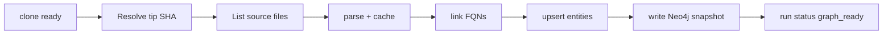

# Phase 1 — Parse + Identity (3–4 weeks)

Depends on: [Phase 0 — Foundations](phase_0_foundations_b8568134.plan.md)  
Parent: [Git With It Blueprint](git_with_it_blueprint_dc3c8bbe.plan.md)

**Goal:** After clone, analyze the tip (or a chosen SHA): parse TS/JS + Python, upsert stable entities, and expose a package/file dependency graph for that single snapshot in Neo4j.

**Exit criteria**

- `gwi-parse` extracts packages, files, classes/functions, imports for TS/JS and Python fixtures
- `entities` + `entity_appearances` populated with deterministic FQN-based UUIDs
- Blob parse cache hits on identical `blob_oid`
- Neo4j contains one snapshot graph for tip SHA (package + file nodes, `IMPORTS`/`DEPENDS_ON`/`CONTAINS`)
- API: `GET /v1/repos/:id/graph?sha=` returns capped package graph JSON
- Golden fixture tests pass in CI

---

## Scope

**In:** tree-sitter language packs (TS/JS, Python); linker for import resolution; entity identity; single-SHA Neo4j write; parse job after clone; graph query API (read slice).

**Out:** multi-commit evolution, deltas, ClickHouse metrics UI, AI, SCIP, call-graph completeness guarantees.

---

## Workstreams

### 1. Rust crates

| Crate | Responsibility |
|---|---|
| `gwi-git` | Read blobs by OID from bare repo (extend Phase 0) |
| `gwi-parse` | tree-sitter extract → `Symbol` / `UnresolvedRef` JSONL |
| `gwi-link` | Resolve imports to FQNs using package roots + path aliases |
| `gwi-graph` | Build adjacency; emit Neo4j / PG upsert payloads |

Worker-ts orchestrates: unpack bare tar → invoke crates → write PG/Neo4j.

### 2. Extraction model

Per file output:

- Symbols: `kind`, `name`, `fqn`, `span`, `export`
- Unresolved refs: `kind` (`import|call|extends|…`), `raw`, `span`
- File facts: language, loc, package guess (`package.json` / `pyproject` / directory)

**FQN rules (ADR):** normalize path separators; TS `path#Symbol` / `path#Class.method`; Python `module.path.Class.method`.

### 3. Postgres identity

- `entities` — unique `(repo_id, kind, fqn)`; UUID stable for life of FQN
- `entity_appearances` — `(entity_id, commit_sha, path, content_hash, loc, meta)`
- `parser_versions` / `analyzer_version` on `analysis_runs`
- Deterministic UUID: UUIDv5 from `repo_id + kind + fqn` (document namespace UUID in ADR)

### 4. Blob cache

- Key: `blobs/{oid}.parse.json.zst` in MinIO (or local RocksDB later)
- Skip re-parse when oid cached for current `analyzer_version`

### 5. Neo4j single snapshot

- Delete/replace prior graph for `(repo_id, sha)` **or** label nodes with `sha` property for MVP simplicity
- **Phase 1 choice:** nodes/edges tagged `repo_id` + `sha` (full replace per re-analyze of tip). Temporal validity deferred to Phase 2.
- Constraints: unique `(repo_id, sha, id)` 
- Default write: Package, File, and exported Class/Function; edges CONTAINS, IMPORTS, DEPENDS_ON (file→file)

### 6. Pipeline extension

BullMQ queues: `parse`, `graph_write` (after `clone`).

### 7. API

- `GET /v1/repos/:id/graph?sha=&view=package|file&focus=&depth=`
- Server caps nodes (e.g. 500) and degree; package view default
- `GET /v1/repos/:id/entities?q=` basic search by FQN

### 8. Fixtures and tests

- `testdata/repos/ts-mini`, `testdata/repos/py-mini` with expected graph JSON golden files
- Property: same analyzer_version ⇒ identical entity UUIDs across runs

---

## ADRs

1. UUIDv5 entity IDs from FQN
2. Phase 1 sha-tagged snapshot graphs (temporal edges in Phase 2)
3. tree-sitter-only; no SCIP yet

---

## Risks

- TS path aliases (`paths` in tsconfig) — implement basic `tsconfig` paths reader
- Monorepo package boundaries wrong — use nearest `package.json` / Python package root heuristics
- Neo4j replace cost — acceptable for single SHA MVP
