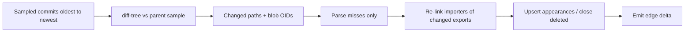

# Phase 2 — Evolution MVP (3–4 weeks)

Depends on: [Phase 1 — Parse + Identity](phase_1_parse_identity_845645e8.plan.md)  
Parent: [Git With It Blueprint](git_with_it_blueprint_dc3c8bbe.plan.md)

**Goal:** Walk a sampled first-parent history, parse incrementally, store graph evolution as deltas (not full copies per commit), expose commit-to-commit graph diffs, and produce a structural timeline of architectural events.

**Exit criteria**

- Analysis run samples commits (e.g. last 100 + monthly anchors) on first-parent order with monotonic `topo_index`
- Only changed blobs re-parsed; parse cache + reverse-import invalidation works
- Neo4j uses temporal edge validity (`valid_from` / `valid_to`); Phase 1 sha-tagged full copies retired or migrated
- S3 checkpoints every K commits; delta artifacts between consecutive samples
- `GET /v1/repos/:id/graph/diff?from=&to=` returns node/edge add/remove + highlight set
- `GET /v1/repos/:id/timeline` returns typed `evolution_events`
- Fixture repo with known rename + new dependency cycle asserts correct events in CI

---

## Scope

**In:** commit sampling, incremental parse pipeline, entity rename chains (git `-M` + FQN map), temporal graph writes, `gwi-diff`, evolution event rules, diff + timeline APIs, checkpoint/delta storage.

**Out:** ClickHouse metrics dashboards (Phase 3), AI narratives (Phase 4), arbitrary expensive compare across huge ranges without checkpoints, full every-commit density by default.

---

## Workstreams

### 1. Commit enumeration and sampling

Extend `gwi-git` / worker:

- Walk first-parent from default branch tip
- Persist `commits` rows: `sha`, `parent_shas[]`, `authored_at`, `message`, `topo_index`
- **Sampler (configurable per run):**
  - Always include tip
  - Last N commits (default 100)
  - Plus one anchor per calendar month (or every Nth beyond window)
- Store selected set on `analysis_runs.sample_shas` / `commit_samples` table
- Document first-parent policy in ADR (merge-commit topology deferred)

### 2. Incremental parse

Rules:

- Content-addressed blob cache from Phase 1 remains authoritative
- Maintain reverse index: `fqn_export → importer_file_ids` from prior snapshot (Postgres or side table)
- Deleted files → close `entity_appearances` and edge `valid_to`
- Parallelism: shard by file within a commit; **one Neo4j writer per repo** to avoid races

### 3. Entity identity across commits

- Exact `(repo_id, kind, fqn)` → same UUID
- Apply `git diff -M` renames: remap path-prefix FQNs; keep UUID; append `entity_renames` / set `rename_of`
- Heuristic fallback (Phase 2 basic): same kind + high content-hash similarity when path rename missed — confidence score on rename event
- Split/merge: birth new entities; link `derived_from` without forcing single ID

### 4. Temporal graph storage (migrate from Phase 1)

**Locked approach from blueprint:** hybrid temporal edges + checkpoints.

- Nodes: one Neo4j node per entity id (repo-scoped); presence via appearances in PG and/or `PRESENT_IN` with validity
- Edges: `valid_from` / `valid_to` as `topo_index` longs; `added_in` / `removed_in` shas
- Materialize-at-SHA: Cypher filter `valid_from <= idx < valid_to` **or** checkpoint + replay deltas
- Checkpoint every K sampled commits (default K=25) → Parquet/JSON adjacency to MinIO `graphs/{repo_id}/ckpt/{sha}.zst`
- Delta log: `graphs/{repo_id}/deltas/{from}_{to}.zst` + `graph_deltas` metadata in PG

Migration: one-shot job to convert latest Phase 1 sha-tagged graph into temporal form at tip, then backfill samples.

### 5. Graph diff algorithm (`gwi-diff`)

Input: materialized graphs (or delta-applied) at SHA_A, SHA_B.

1. Align entities by stable id (+ rename chains)
2. Node sets: added / removed / renamed
3. Edge key `(from_id, type, to_id)`: added / removed / reweighted
4. Structural detectors (package graph):
   - New or enlarged SCCs / cycles (Tarjan)
   - Fan-in/out deltas above thresholds
   - Large dependency additions/removals (e.g. new package edge)
5. Emit `GraphDiff` artifact + feed event rules

API returns diff summary + optional `highlight_subgraph` ids for UI (UI polish in Phase 3; API ready here).

### 6. Evolution events

Postgres `evolution_events`:

- `repo_id`, `from_sha`, `to_sha`, `authored_at`, `type`, `severity`, `title`, `payload` JSON, `entity_ids[]`

**MVP event types:**

| Type | Trigger |
|---|---|
| `dependency_added` / `dependency_removed` | Package/file DEPENDS_ON edge birth/death |
| `cycle_introduced` / `cycle_resolved` | SCC appearance/disappearance |
| `module_added` / `module_removed` | Package node birth/death |
| `rename_detected` | Entity rename chain |
| `coupling_spike` | Fan-in/out Δ above rule threshold |

Rules engine: deterministic thresholds in code/config; no LLM in Phase 2.

### 7. Pipeline / jobs

BullMQ (or continue saga):

1. `clone` (Phase 0)
2. `enumerate_sample`
3. `parse_commit` (batched, oldest→newest)
4. `graph_write_delta`
5. `checkpoint` (every K)
6. `evolve` — consecutive pair diffs → events
7. Mark run `evolution_ready`

Progress: `commits_done/total` on run; tip graph available before full backfill completes (**progressive delivery**).

### 8. API additions

- `GET /v1/repos/:id/commits?sampled=true`
- `GET /v1/repos/:id/graph?sha=` — materialize via temporal filter (replace Phase 1 semantics)
- `GET /v1/repos/:id/graph/diff?from=&to=`
- `GET /v1/repos/:id/timeline?from=&to=`
- `POST /v1/repos/:id/compare` — body `{ from, to }` → diff id / payload

Refuse unbounded compare when no checkpoint path exists and hop count exceeds limit (e.g. 200 samples); return `412` with guidance.

### 9. Minimal UI hooks (API-complete; light UI ok)

- Repo page: sample commit picker + “Compare” using diff API JSON view acceptable if full viz waits for Phase 3
- Timeline list view of evolution events (simple table)

---

## ADRs

1. First-parent sampling policy and default density
2. Temporal edges + checkpoint/delta hybrid (retire sha-tagged full graphs)
3. Evolution event taxonomy and severity rules
4. Single-writer-per-repo for Neo4j deltas

---

## Test plan

- Golden: mini repo history introducing a cycle → `cycle_introduced` between specific shas
- Golden: file rename → same entity UUID + `rename_detected`
- Property: replay deltas from checkpoint equals materialize-at-SHA via Cypher validity filter
- Load smoke: 500 sampled commits on medium fixture; assert memory bounds on worker

---

## Risks

- Temporal write amplification on Neo4j — batch edges; keep MVP at package/file granularity for history (symbol edges tip-only if needed)
- Rename false positives — require git rename OR high confidence; surface confidence in payload
- Users expect every commit — product copy + progressive densification later
- Migration from Phase 1 graphs — ship converter before enabling dual-write

---

## Deliverables checklist

- [x] Sampled commit walk + topo_index
- [x] Incremental parse + invalidation
- [x] Temporal Neo4j + checkpoints/deltas
- [x] gwi-diff + evolution_events
- [x] Diff + timeline APIs
- [x] CI goldens for cycle + rename
- [x] ADRs merged
