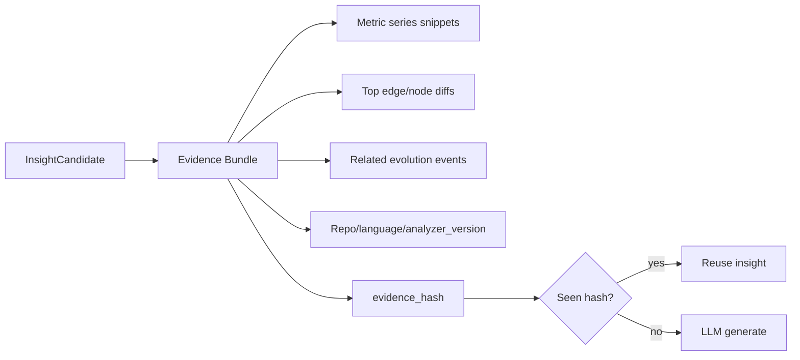

# Phase 4 — AI Insights (2–3 weeks)

Depends on: [Phase 3 — Metrics + UI](phase_3_metrics_ui_c435d86b.plan.md)  
Parent: [Git With It Blueprint](git_with_it_blueprint_dc3c8bbe.plan.md)

**Goal:** Turn structural events and metric anomalies into grounded natural-language architectural insights (5–10 per run for MVP), with strict evidence binding so the model narrates facts—never invents topology.

**Exit criteria**

- Deterministic anomaly/event selector produces ranked candidates per analysis run
- Evidence bundles stored with hash; LLM outputs validate against JSON schema or are rejected
- `insights` rows persist headline, narrative, severity, category, entity_ids, commit range, model, evidence_hash, confidence
- Insights API + Insights UI feed (filter by severity/category); click-through to Timeline/Compare/Graph with entities highlighted
- Deduped cache by `evidence_hash`; provider abstraction (Anthropic and/or OpenAI)
- Eval harness: fixed bundles → groundedness checks in CI (no live key required for schema/unit tests; optional nightly live eval)
- Empty-evidence path never calls the LLM

---

## Scope

**In:** anomaly detection, evidence bundle builder, AI worker, provider adapter, prompt templates, schema validation, insights persistence + API, Insights UI, basic `pgvector` embedding for similar insights (optional stretch within phase if time), webhooks `insight.created`.

**Out:** Autofix PRs, predictive ML models, GitHub PR review bot (stretch/Phase 5+), fine-tuning, ungrounded chat over the whole repo.

---

## Principle (non-negotiable)

**Metrics, diffs, and evolution events are the source of truth.** The LLM may only restate, rank, and explain numbers/entities present in the evidence bundle. UI must show “Based on measured signals” and link to underlying events/metrics.

---

## Workstreams

### 1. Anomaly / candidate detection (deterministic)

Run after Phase 2 `evolve` + Phase 3 `metrics_write` complete for a run (or on a sliding window at tip).

**Candidate sources:**

| Source | Example signal |
|---|---|
| Evolution events | `cycle_introduced`, `coupling_spike`, high-severity dependency shifts |
| Metric deltas | Entity fan-in/out or complexity_proxy ↑ &gt; threshold over window (e.g. 4 months / N samples) |
| Absolute hotspots | Top-K fan-in or loc at tip |
| God-object heuristic | Fan-in + loc + outbound deps all in top percentile |

Output: ranked `InsightCandidate[]` with `type`, `entity_ids`, `from_sha`, `to_sha`, `score`, `signal_refs`.

Cap to top **10** candidates per run (configurable). Prefer diversity (don’t emit 10 insights on same package).

### 2. Evidence bundle



Bundle contents (versioned schema `evidence_v1`):

- Entity FQNs + kinds
- Numeric series (sampled points, not prose)
- Diff summary counts + top changed edges (ids/FQNs only)
- Event titles/types/severities
- Explicit **allowed claims** list (e.g. “fan_in PaymentService 12 → 28”)

Persist bundle JSON in MinIO or PG (`insight_evidence`); `evidence_hash = sha256(canonical_json)`.

### 3. Prompting and validation

- System prompt: architect narrator; forbid entities/metrics not in bundle; require JSON only
- User payload: `evidence_v1` blob
- **Output schema:**

```
{
  headline: string,
  narrative: string,
  severity: "low"|"medium"|"high"|"critical",
  category: "debt"|"drift"|"risk"|"refactor"|"hotspot",
  entity_ids: uuid[],
  confidence: number,
  suggested_actions: string[],
  cited_signals: string[]  // must reference signal ids from bundle
}
```

- Validate with Zod/JSON Schema; require `cited_signals ⊆ bundle.signals`; require `entity_ids ⊆ bundle.entities`
- On failure: one repair retry; then mark candidate `failed_validation` (no publish)

### 4. Provider abstraction

```
InsightProvider.generate(bundle) -> raw_text
```

- Env-configured: `ANTHROPIC_API_KEY` / `OPENAI_API_KEY`; model tiers (cheap bulk vs strong for high-severity)
- Timeouts, token limits, cost logging per org
- No provider → run completes with candidates only + UI banner “AI disabled”

### 5. Persistence and jobs

Tables:

- `insights` — full validated payload + `run_id`, `repo_id`, `from_sha`, `to_sha`, `model`, `prompt_hash`, `evidence_hash`, `status`
- `insight_candidates` — optional debug/audit of selection

BullMQ queue `ai` after `evolve` (+ metrics). Idempotent on `(run_id, evidence_hash)`.

Webhook: `insight.created` (Phase 0 webhook stub if present; else add minimal dispatcher).

### 6. APIs

- `GET /v1/repos/:id/insights?severity=&category=`
- `GET /v1/repos/:id/insights/:insightId`
- `GET /v1/repos/:id/entities/:entityId/insights`
- Internal: `POST /v1/repos/:id/runs/:runId/insights/regenerate` (org admin)

### 7. Insights UI (replace placeholder)

- Feed on `/[org]/[repo]/insights`: cards with headline, severity chip, narrative, cited signal chips
- Actions: “View compare”, “View in graph”, “View metrics” with deep links (`from`/`to`/`focus`)
- Overview widget: top 3 high-severity insights
- Graph side panel: insights mentioning selected entity
- Loading/skeleton while `ai` job runs; partial stream optional (MVP: poll run until insights ready)

### 8. Optional within phase: embeddings

If schedule allows: embed `headline+narrative` into `pgvector`; “Similar past insights” on detail page. Otherwise defer to Phase 5.

### 9. Eval and safety

- Fixture bundles in `testdata/insights/` with expected cited_signals constraints
- CI: validator unit tests + “LLM mock” integration (fixture response)
- Nightly (optional): live provider eval scoring groundedness (numbers in narrative must appear in bundle)
- Redaction: strip secrets from file paths if matched by simple PATTERNS; never put file contents in bundles (metadata only)
- Rate limit AI jobs per org

---

## ADRs

1. Evidence-grounded insights only (no freeform repo chat in MVP)
2. Provider adapter + model tiering
3. Insight JSON schema and validation failure policy
4. Candidate ranking and diversity rules

---

## Test plan

- Unit: anomaly thresholds, diversity picker, hash stability, schema validator
- Integration: mock provider → insight row + API + UI deep link params
- Negative: empty bundle ⇒ zero LLM calls
- Golden narrative not required; golden **citations** required

---

## Risks

- Hallucinated FQNs — blocked by schema entity allowlist
- Cost blowups on large orgs — hard cap candidates + cache by evidence_hash
- Noisy insights — tune thresholds; allow “dismiss” later (Phase 5)
- Latency — run AI async; UI must not block graph/metrics
- Overclaiming complexity — prompt + UI copy must say “complexity proxy” when citing that metric

---

## Deliverables checklist

- [ ] Candidate detector + evidence_v1 bundles
- [ ] AI worker + provider adapter + schema validation
- [ ] insights table/API/webhooks
- [ ] Insights feed + overview + graph deep links
- [ ] Mock-provider CI + groundedness unit tests
- [ ] ADRs merged
