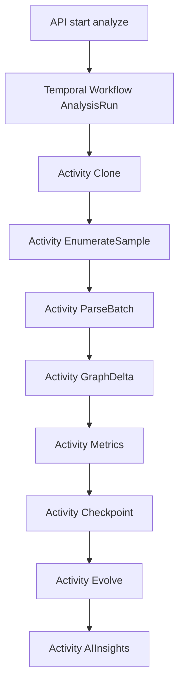

# Phase 5 — Hardening (ongoing)

Depends on: [Phase 4 — AI Insights](phase_4_ai_insights_58efc64d.plan.md)  
Parent: [Git With It Blueprint](git_with_it_blueprint_dc3c8bbe.plan.md)

**Goal:** Take the MVP from “works on demo repos” to a production multi-tenant platform: broader language coverage, durable orchestration, tenancy isolation, quotas/billing, operational excellence, and a clear path to enterprise features—without rewriting the core architecture.

**Exit criteria (rolling; ship behind flags)**

- Language packs: Go + Java baseline (tree-sitter); SCIP optional path for TS and/or Go behind feature flag
- Analysis workflows run on **Temporal** (or equivalent durable engine); BullMQ relegated to light jobs or removed
- Per-org quotas (repos, analysis minutes, AI calls) enforced; basic billing (Stripe) or “contact sales” plans
- Multi-tenant data isolation verified (PG row-level org_id, Neo4j repo scoping, object-store prefixes); large-customer isolation story documented
- Staging + prod K8s deploy via Terraform/Helm; backups, alerts, SLO dashboards
- Load test against target envelope (blueprint: ~5M LOC class fixture / 10k sampled commits path) with documented limits and auto sample-density backoff
- Security review: parse-only sandbox, secret scanning on clone, dependency scanning in CI

---

## Scope

**In:** languages, SCIP upgrade path, Temporal migration, quotas/billing, tenancy hardening, cold storage, densification controls, dismissible insights, GitHub App (light), on-call/ops, ADR updates.

**Out (track as enterprise follow-ons, design seams only):** full SSO/SCIM, air-gapped appliance, PR review bot v1 may be thin wedge only, VS Code extension, portfolio multi-repo views (API stubs ok).

---

## Workstreams

### 1. Language expansion

| Priority | Language | Approach |
|---|---|---|
| P0 | Go | tree-sitter-go extract + module path FQNs |
| P0 | Java | tree-sitter-java; package FQNs; Maven/Gradle roots heuristic |
| P1 | C# | tree-sitter-c-sharp if demand |
| P1 | Kotlin / TSX edge cases | extend existing packs |

Shared `LanguagePack` trait/plugin API from Phase 1 must remain stable; golden fixtures per language.

### 2. SCIP optional precision path

- Feature flag `scip_enabled` per repo/org
- Run `scip-typescript` / `scip-go` (etc.) in sandbox **without executing project build scripts that are untrusted** — prefer pre-index upload or allowlist trusted CI index upload for enterprise; for SaaS MVP: attempt indexer only when lockfiles + known safe invoke patterns exist, else skip
- Map SCIP symbols → entity FQNs; upgrade `CALLS` edges confidence
- UI badge: “Precision: structural | SCIP”

**Decision:** SCIP is additive; tree-sitter remains default so analysis never depends on full project build.

### 3. Orchestration migration (BullMQ → Temporal)

- Heartbeats on long parse batches; cancel/terminate from UI
- Child workflows for shard batches on huge repos
- Retain idempotency keys `(repo_id, analyzer_version, sha, stage)`
- Migration plan: dual-run in staging; cutover flag; delete BullMQ heavy queues after soak

### 4. Multi-tenant isolation and scale

- Enforce `org_id` on every query path; automated tests for cross-tenant IDOR
- Neo4j: `repo_id` on all nodes; consider **database-per-enterprise-customer** for design partners
- MinIO/S3 prefixes `orgs/{org_id}/repos/{repo_id}/...`
- ClickHouse partition by `repo_id`; quota on metric cardinality
- **Cold storage:** age fine-grained symbol edges older than N months to S3; keep package graph + metrics
- Auto **sample density backoff** when ETA exceeds SLA; tip-first progressive delivery mandatory
- Single-writer-per-repo remains; horizontal workers by org/repo lease

### 5. Quotas, plans, billing

- Tables: `plans`, `subscriptions`, `usage_counters` (repos, parse_minutes, ai_calls)
- Enforce at analyze + AI enqueue
- Stripe Checkout for Team plan; Free tier limits documented
- Admin UI: usage, soft/hard limits, grace period

### 6. Product hardening

- Insight dismiss / snooze; feedback thumbs for prompt tuning
- Reanalyze controls: tip-only vs full resample; analyzer_version bump UX
- GitHub App (thin): install, sync default branch on push, re-queue tip analyze
- Architecture fitness rules (stretch): YAML rules for forbidden deps → events
- NL graph query (stretch): constrained Cypher generation from allowlisted templates only

### 7. Deployment and SRE

- Terraform: VPC, K8s, managed PG, Redis, Neo4j Aura or operator, ClickHouse, S3, Temporal Cloud or self-host
- Helm charts for `api`, `web`, `worker-rust`, `worker-ts`, Temporal workers
- Environments: staging (ephemeral demo repos) → prod
- Backups: PG PITR, Neo4j backups, S3 versioning; rebuild-from-git runbook
- SLOs: API availability, analyze tip latency p50/p95, queue lag
- Alerts: failed workflows, Neo4j disk, AI error rate, quota exhaustion
- OpenTelemetry traces across API → Temporal → workers

### 8. Security

- Parse-only: no `npm install` / `go test` on customer code in default path
- Clone size limits, file count limits, timeout policies
- Secret scanning on clone (gitleaks or equivalent); block or redact
- Encrypt PATs/App credentials at rest (KMS)
- Penetration pass on authZ; dependency scanning (Dependabot/Snyk)
- Threat model doc in `docs/security/`

### 9. Testing and quality gates

- Expand language goldens
- Load test suite + capacity playbook
- Chaos: kill worker mid-run → Temporal resume
- Contract tests for public API v1 stability
- Insight eval nightly with live provider (optional)

### 10. Enterprise seams (document + stubs)

Design but do not fully build unless a design partner pays:

- SAML/OIDC SSO, SCIM
- Audit log export
- VPC / private link
- Data residency region pins
- Portfolio view across repos
- Jira/Linear ticket export from insights

---

## ADRs

1. Temporal as system of record for analysis workflows
2. SCIP as optional precision tier
3. Quotas and Free/Team/Enterprise plan boundaries
4. Cold storage and retention policy
5. GitHub App permission surface (least privilege)

---

## Suggested sequencing (within Phase 5)

1. **Weeks 1–3:** Go/Java packs + tenancy IDOR tests + quotas  
2. **Weeks 4–7:** Temporal migration + staging cutover  
3. **Weeks 6–9:** Billing + GitHub App push sync (parallelizable)  
4. **Weeks 8–12:** SCIP flag, cold storage, load test, prod SLO harden  
5. **Ongoing:** enterprise seams, fitness rules, NL query templates  

---

## Risks

- Temporal migration regressions on idempotency — exhaustive activity tests required  
- SCIP/build execution = RCE risk — never run arbitrary customer build scripts in shared SaaS  
- Neo4j cost at scale — package rollups + cold storage non-optional  
- Billing complexity — start with simple seat+repo limits  
- Scope creep into “enterprise everything” — timebox seams vs delivery  

---

## Deliverables checklist

- [ ] Go + Java language packs + goldens  
- [ ] Temporal analysis workflow in staging/prod  
- [ ] Quotas + Stripe (or equivalent) Team plan  
- [ ] IDOR/tenancy test suite green  
- [ ] K8s/Terraform deploy + SLO dashboards  
- [ ] Security threat model + secret scanning  
- [ ] Load test report + auto density backoff  
- [ ] SCIP feature-flagged path (at least one language)  
- [ ] GitHub App tip reanalyze  
- [ ] ADRs merged  

This completes the phase-plan set (Phases 0–5) under the master blueprint.
