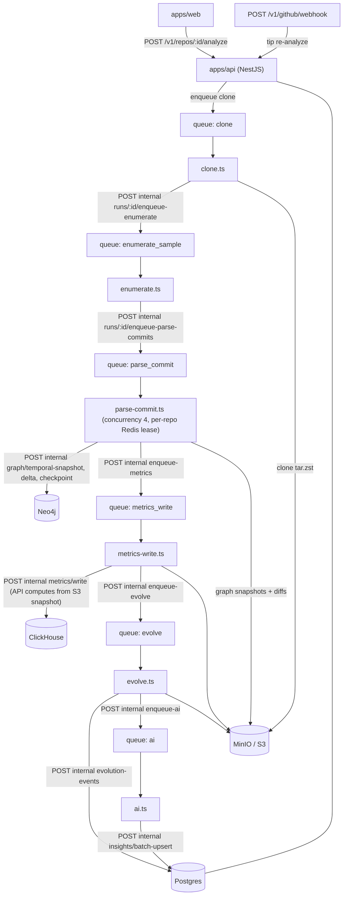

# How Git With It actually works

Operational map of the **live** system: the BullMQ pipeline, the five stores, and the traps that
have already cost us time. Design that never shipped is listed in the
[ADR status](#adr-status) table at the bottom — check that table before resurrecting code from git
history. (Temporal workflow code, the SCIP precision tier, the `gwi-metrics` crate, and the Stripe
checkout path were all built, never wired up, and deleted.)

## Read in this order

| # | Path | What you learn |
|---|---|---|
| 1 | `apps/api/src/repos/repos.controller.ts` → `analyze()` | Entry point: quota check → `analysis_runs` row → `jobs` row → `clone` job |
| 2 | `apps/worker-ts/src/clone.ts` | Bare clone (or fetch) → `tar.zst` in MinIO → enqueue `enumerate_sample` |
| 3 | `apps/worker-ts/src/enumerate.ts` | First-parent sampling (ADR 0008) → `commits` upsert → enqueue `parse_commit` |
| 4 | `apps/worker-ts/src/parse-commit.ts` | The real work: tip-first parse, per-sample S3 graph snapshots, Neo4j temporal deltas, checkpoints |
| 5 | `apps/worker-ts/src/metrics-write.ts` | Per-sample metrics via the API → ClickHouse, then enqueue `evolve` |
| 6 | `apps/worker-ts/src/evolve.ts` | Consecutive snapshot diffs → `evolution_events`, then enqueue `ai` |
| 7 | `apps/worker-ts/src/ai.ts` | Grounded evidence bundles → `insights` |
| 8 | `apps/api/src/repos/internal.controller.ts` | Every `/v1/internal/*` callback the worker fans out to (single-writer for Postgres/Neo4j/ClickHouse) |
| 9 | `apps/api/src/jobs/jobs.service.ts` | The only place queues are declared — worker `index.ts` must match it |

## Pipeline

Six BullMQ queues. Each stage is a worker processor that calls back into the API through
`/v1/internal/*`; the **API owns all writes to Postgres, Neo4j and ClickHouse**, workers only hold
S3/Redis credentials plus the service token.

| Queue | Payload schema (`@gwi/shared-types`) | Worker | Run status it sets | Fans out to |
|---|---|---|---|---|
| `clone` | `CloneJobPayloadSchema` | `clone.ts` | `cloning` → `ready` | `enqueue-enumerate` |
| `enumerate_sample` | `EnumerateSampleJobPayloadSchema` | `enumerate.ts` | `enumerating` | `commits/upsert`, `enqueue-parse-commits` |
| `parse_commit` | `ParseCommitJobPayloadSchema` | `parse-commit.ts` (via `repo-lock.ts`) | `parsing` → `graph_ready` | `graph/temporal-snapshot`, `graph/delta`, `graph/checkpoint`, `graph/temporal-bootstrap`, `entities/upsert`, `entities/renames`, `enqueue-metrics` |
| `metrics_write` | `MetricsWriteJobPayloadSchema` | `metrics-write.ts` | `metrics_writing` → `evolving` | `metrics/write`, `enqueue-evolve` |
| `evolve` | `EvolveJobPayloadSchema` | `evolve.ts` | `evolving` → `ai_generating` | `evolution-events`, `enqueue-ai` |
| `ai` | `AiGenerateJobPayloadSchema` | `ai.ts` | `ai_generating` → `evolution_ready` | `insights/batch-upsert` |

Terminal run status is `evolution_ready` (or `failed`). `POST /v1/repos/:id/runs/:runId/insights/regenerate`
re-enqueues only the `ai` queue.

### How the worker authenticates

`apps/worker-ts/src/api.ts` sends `Authorization: Bearer sha256("gwi-service:" + AUTH_SECRET)`.
Rotating `AUTH_SECRET` invalidates every worker in flight, so roll workers with the API.

## The five stores

| Store | Owns | Written by | Traps |
|---|---|---|---|
| **Postgres** (Drizzle, `apps/api`) | Orgs, users, invites, repos, runs, jobs, commits, samples, entities, renames, `graph_deltas`, `evolution_events`, insights, plans/subscriptions/usage | API only (`internal.controller.ts` for worker callbacks) | Migrations are hand-written — see traps 1 and 6 |
| **Redis** | BullMQ queues, response cache, per-repo Neo4j writer lease (`gwi:neo4j-writer:{repoId}`) | API + worker | Lease default TTL 10 min / wait 15 min (`repo-lock.ts`) |
| **MinIO / S3** | `clone` tar.zst archives, per-sha graph snapshots, compressed graph diffs, cold-storage exports | Worker (writes), API (reads) | Key layout has legacy fallbacks — trap 4 |
| **Neo4j** | Temporal graph: nodes/edges with validity intervals, checkpoints | API only, single writer per repo (ADR 0011) | Reads are in `queryGraphSlice`; do not add a second writer |
| **ClickHouse** | Metric rows (`metrics/*` API reads) | API only (`writeMetricRows`) | Metric computation happens in the API, not in the worker — trap 2 |

## Traps

1. **Migrations are hand-written SQL.** `apps/api/drizzle/*.sql` plus a manual `meta/_journal.json`
   entry; there are no drizzle-kit snapshots. Never run `db:generate` — a generated migration would
   try to recreate the entire schema. Copy the style of `0008_drop_unused_columns.sql`.
2. **The API computes metrics, not the worker.** `metrics-write.ts` posts `{ sha, topoIndex, artifactUri }`
   and the API loads the graph from MinIO and calls `computeMetrics`. Large inline `rows` payloads
   still work (fixtures / backwards compat) but would blow the 10 MB body limit at real sizes.
3. **`parse_commit` runs at concurrency 4 but Neo4j has exactly one writer per repo**
   (`withRepoNeo4jLock`). Any new code that writes Neo4j outside that lock races other repos' deltas.
4. **S3 keys have legacy fallbacks.** Always read through `graphSnapshotCandidates()`
   (`metrics-write.ts`, `evolve.ts`) instead of constructing a key by hand.
5. **`analyzer_version` is a cache/dedup key** on artifacts and runs. Bump `ANALYZER_VERSION` when
   parser semantics change or stale snapshots will be reused.
6. **The Postgres `job_type` enum still lists removed queues** (`parse`, `graph_write`,
   `graph_write_delta`, `checkpoint`) — Postgres cannot drop enum values in place. The Zod `JobType`
   in `@gwi/shared-types` lists only live queues; treat the DB enum as append-only.
7. **Quotas are enforced at enqueue in the API** (`QuotasService.assertCanEnqueueAnalyze/Ai`).
   Workers trust that pre-check; there is no billing provider wired up (`dev/attach-team` is a
   prod-guarded local helper).
8. **Windows / OneDrive:** ephemeral git workspaces under `.tmp/workspaces` break on synced paths.
   Use WSL2 or run the worker in Docker.

## ADR status

| ADR | Status | Note |
|---|---|---|
| 0001 BullMQ not Temporal | Accepted | Temporal never shipped (ADR 0016 rejected) |
| 0002 Drizzle + Postgres SoR | Accepted | |
| 0003 Bare clone `tar.zst` | Accepted | |
| 0004 Auth.JS-compatible credentials | Accepted | |
| 0005 tree-sitter only | Accepted | SCIP tier deleted (ADR 0017 rejected) |
| 0006 UUIDv5 entity ids | Accepted | |
| 0007 Phase 1 sha-tagged snapshots | Superseded by 0009 | |
| 0008 first-parent sampling | Accepted | |
| 0009 temporal edges + checkpoints | Accepted | |
| 0010 evolution event taxonomy | Accepted | |
| 0011 single writer per repo (Neo4j) | Accepted | Live via `repo-lock.ts` |
| 0012 ClickHouse metrics SoR | Accepted | |
| 0013 complexity proxies | Accepted | |
| 0014 Sigma + Graphology | Accepted | |
| 0015 shareable URL state | Accepted | |
| 0016 Temporal workflows | **Rejected** | Scaffolding deleted; BullMQ retained |
| 0017 SCIP precision tier | **Rejected** | `scip.ts`, `/precision`, `precision_mode` deleted |
| 0018 quotas + plan boundaries | Accepted (amended) | Quotas live; Stripe columns dropped in migration `0008` |
| 0019 cold storage retention | Accepted | |
| 0020 GitHub App permissions | Accepted | |
| 0021 design tokens | Accepted | |
| 0022 AI insights grounding | Accepted | |
| 0023 personal workspaces + invites | Accepted | |

## What was deleted (and why not to bring it back)

| Removed | Reason | Evidence it was dead |
|---|---|---|
| `parse` + `graph_write` queues and processors | Superseded by `parse_commit` (per-sample, incremental) | No enqueue callers; duplicated `bare.ts` / `parse-commit.ts` helpers |
| `apps/api/src/temporal/**`, `worker-ts/src/temporal/**`, `temporal-worker.ts` | Dual-run soak never happened | Only reachable when `ORCHESTRATOR=temporal`, which no deploy set |
| `apps/worker-ts/src/scip.ts`, `POST /v1/internal/repos/:id/precision`, `repositories.precision_mode` | Precision tier never ran (`SCIP_ENABLED` unset everywhere) | Only caller was the flag-gated block in `parse-commit.ts` |
| `crates/gwi-metrics` | Metrics moved into the API (`computeMetrics`) | No reference from JS apps or other crates |
| `POST /v1/billing/checkout`, `STRIPE_*`, `plans.stripe_price_id`, `subscriptions.stripe_*` | No payment provider wired; no billing UI | Nothing read `stripePriceId` except the checkout route itself |
| `packages/eslint-config` | Superseded by root flat ESLint config | Not referenced by any package |

