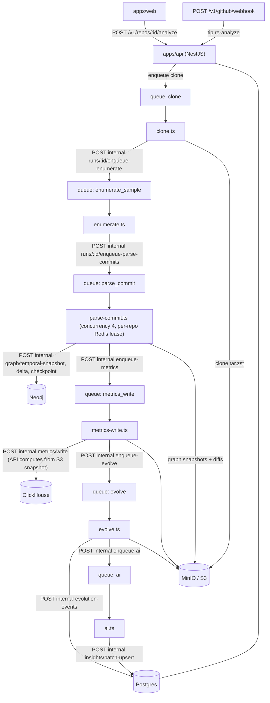

# How Git With It actually works

Operational map of the **live** system: the BullMQ pipeline, the five stores, and the traps to
watch for.

## Read in this order

| # | Path | What you learn |
|---|---|---|
| 1 | `apps/api/src/repos/repos.controller.ts` → `analyze()` | Entry point: `analysis_runs` row → `jobs` row → `clone` job |
| 2 | `apps/worker-ts/src/clone.ts` | Bare clone (or fetch) → secret scan → `tar.zst` in MinIO → enqueue `enumerate_sample` |
| 3 | `apps/worker-ts/src/enumerate.ts` | First-parent sampling → `commits` upsert → enqueue `parse_commit` |
| 4 | `apps/worker-ts/src/parse-commit.ts` | The real work: tip-first parse, per-sample S3 graph snapshots, Neo4j temporal deltas, checkpoints |
| 5 | `apps/worker-ts/src/metrics-write.ts` | Per-sample metrics via the API → ClickHouse, then enqueue `evolve` |
| 6 | `apps/worker-ts/src/evolve.ts` | Consecutive snapshot diffs → `evolution_events`, then enqueue `ai` |
| 7 | `apps/worker-ts/src/ai.ts` | Grounded evidence bundles → `insights` |
| 8 | `apps/api/src/repos/internal.controller.ts` | Every `/v1/internal/*` callback the worker fans out to (single-writer for Postgres/Neo4j/ClickHouse) |
| 9 | `apps/api/src/jobs/jobs.service.ts` | The only place queues are declared — worker `index.ts` must match it |

## Pipeline

Six BullMQ queues. Each stage is a worker processor that calls back into the API through
`/v1/internal/*`; the **API owns all writes to Postgres, Neo4j and ClickHouse**, workers only hold
S3/Redis credentials plus the service token.

```mermaid
flowchart TD
  UI["apps/web"] -->|"POST /v1/repos/:id/analyze"| API["apps/api (NestJS)"]
  GH["POST /v1/github/webhook"] -->|"tip re-analyze"| API
  API -->|"enqueue clone"| Q1["queue: clone"]
  Q1 --> W1["clone.ts"]
  W1 -->|"POST internal runs/:id/enqueue-enumerate"| Q2["queue: enumerate_sample"]
  Q2 --> W2["enumerate.ts"]
  W2 -->|"POST internal runs/:id/enqueue-parse-commits"| Q3["queue: parse_commit"]
  Q3 --> W3["parse-commit.ts (concurrency 4, per-repo Redis lease)"]
  W3 -->|"POST internal graph/temporal-snapshot, delta, checkpoint"| NEO[("Neo4j")]
  W3 -->|"POST internal enqueue-metrics"| Q4["queue: metrics_write"]
  Q4 --> W4["metrics-write.ts"]
  W4 -->|"POST internal metrics/write (API computes from S3 snapshot)"| CH[("ClickHouse")]
  W4 -->|"POST internal enqueue-evolve"| Q5["queue: evolve"]
  Q5 --> W5["evolve.ts"]
  W5 -->|"POST internal evolution-events"| PG[("Postgres")]
  W5 -->|"POST internal enqueue-ai"| Q6["queue: ai"]
  Q6 --> W6["ai.ts"]
  W6 -->|"POST internal insights/batch-upsert"| PG
  API --- PG
  W1 -->|"clone tar.zst"| S3[("MinIO / S3")]
  W3 -->|"graph snapshots + diffs"| S3
  W4 --> S3
  W5 --> S3
```

| Queue | Payload schema (`@gwi/shared-types`) | Worker | Run status it sets | Fans out to |
|---|---|---|---|---|
| `clone` | `CloneJobPayloadSchema` | `clone.ts` | `cloning` → `ready` | `enqueue-enumerate` |
| `enumerate_sample` | `EnumerateSampleJobPayloadSchema` | `enumerate.ts` | `enumerating` | `commits/upsert`, `enqueue-parse-commits` |
| `parse_commit` | `ParseCommitJobPayloadSchema` | `parse-commit.ts` (via `repo-lock.ts`) | `parsing` → `graph_ready` | `graph/temporal-snapshot`, `graph/delta`, `graph/checkpoint`, `graph/temporal-bootstrap`, `entities/upsert`, `entities/renames`, `enqueue-metrics` |
| `metrics_write` | `MetricsWriteJobPayloadSchema` | `metrics-write.ts` | `metrics_writing` → `evolving` | `metrics/write`, `enqueue-evolve` |
| `evolve` | `EvolveJobPayloadSchema` | `evolve.ts` | `evolving` → `ai_generating` | `evolution-events`, `enqueue-ai` |
| `ai` | `AiGenerateJobPayloadSchema` | `ai.ts` | `ai_generating` → `evolution_ready` | `insights/batch-upsert` |

Terminal run status is `evolution_ready` (or `failed`). `POST /v1/repos/:id/runs/:runId/insights/regenerate`
re-enqueues only the `ai` queue.

### How the worker authenticates

`apps/worker-ts/src/api.ts` sends `Authorization: Bearer sha256("gwi-service:" + AUTH_SECRET)`.
Rotating `AUTH_SECRET` invalidates every worker in flight, so roll workers with the API.

## Internal API (worker → API)

The worker never holds database credentials. Every stage calls back into the API
under `/v1/internal/*` (`apps/api/src/repos/internal.controller.ts`), the only
writer for Postgres, Neo4j, and ClickHouse. Requests are JSON; the client is
`apiJson()` / `patchRun()` in `apps/worker-ts/src/api.ts`.

**Auth:** `Authorization: Bearer <sha256("gwi-service:" + AUTH_SECRET)>`, checked
by `JwtOrSessionAuthGuard` through `isValidServiceToken()` (constant-time
compare). The service token resolves to a synthetic user
(`service@git-with-it.local`) that also satisfies `OrgMembershipGuard`.

| Method | Path | Purpose |
|---|---|---|
| `GET` | `/v1/internal/repos/:repoId` | Read a repo row |
| `GET` | `/v1/internal/runs/:runId` | Read a run row |
| `PATCH` | `/v1/internal/runs/:runId` | Report run/job/repo status + progress |
| `POST` | `/v1/internal/runs/:runId/enqueue-enumerate` | Enqueue `enumerate_sample` |
| `POST` | `/v1/internal/runs/:runId/enqueue-parse-commits` | Enqueue `parse_commit` |
| `POST` | `/v1/internal/runs/:runId/enqueue-metrics` | Enqueue `metrics_write` |
| `POST` | `/v1/internal/runs/:runId/enqueue-evolve` | Enqueue `evolve` |
| `POST` | `/v1/internal/runs/:runId/enqueue-ai` | Enqueue `ai` |
| `POST` | `/v1/internal/repos/:repoId/commits/upsert` | Upsert commits/samples |
| `POST` | `/v1/internal/repos/:repoId/entities/upsert` | Upsert entities/appearances |
| `POST` | `/v1/internal/repos/:repoId/entities/renames` | Record entity renames |
| `POST` | `/v1/internal/repos/:repoId/graph/temporal-snapshot` | Bootstrap Neo4j graph at a topo index |
| `POST` | `/v1/internal/repos/:repoId/graph/temporal-bootstrap` | Seed Neo4j nodes + first delta |
| `POST` | `/v1/internal/repos/:repoId/graph/delta` | Persist a graph delta + Neo4j edges |
| `POST` | `/v1/internal/repos/:repoId/graph/checkpoint` | Write a Neo4j checkpoint |
| `POST` | `/v1/internal/repos/:repoId/metrics/write` | Compute + write metric rows |
| `POST` | `/v1/internal/repos/:repoId/evolution-events` | Insert `evolution_events` |
| `POST` | `/v1/internal/repos/:repoId/insights/batch-upsert` | Upsert evidence / candidates / insights, then fire the `insight.created` webhook |

Each stage sends `PATCH /v1/internal/runs/:runId` (`UpdateRunBody`: `status`,
`error`, `progress`, `repoStatus`, `jobStatus`, `sampleShas`, `cloneUri`, …) and
then the next `enqueue-*` call, whose body carries `cloneUri`,
`analyzerVersion`, `sampleShas[]`, and an optional `sampleConfig`. Bodies are
zod-validated (a bad payload is a 400); `enqueue-*` returns the created job id.
`metrics/write` loads the graph artifact from S3 (inline `rows` are accepted only
for small fixtures), computes metrics in the API, and writes ClickHouse rows.

## The five stores

| Store | Owns | Written by | Traps |
|---|---|---|---|
| **Postgres** (Drizzle, `apps/api`) | Orgs, users, invites, repos, runs, jobs, commits, samples, entities, renames, `graph_deltas`, `evolution_events`, insights | API only (`internal.controller.ts` for worker callbacks) | Migrations are hand-written — see traps 1 and 6 |
| **Redis** | BullMQ queues, response cache, per-repo Neo4j writer lease (`gwi:neo4j-writer:{repoId}`) | API + worker | Lease default TTL 10 min / wait 15 min (`repo-lock.ts`) |
| **MinIO / S3** | `clone` tar.zst archives, per-sha graph snapshots, compressed graph diffs | Worker (writes), API (reads) | Key layout has fallbacks — trap 4 |
| **Neo4j** | Temporal graph: nodes/edges with validity intervals, checkpoints | API only, single writer per repo | Reads are in `queryGraphSlice`; do not add a second writer |
| **ClickHouse** | Metric rows (`metrics/*` API reads) | API only (`writeMetricRows`) | Metric computation happens in the API, not in the worker — trap 2 |

## Auth: users, workspaces, invites

Login is stateless. The web app (NextAuth, `session.strategy = 'jwt'`,
`apps/web/src/lib/auth.ts`) uses a **CredentialsProvider** whose `authorize()`
POSTs to `POST /v1/auth/login`; the API verifies the bcrypt hash and returns a
signed JWT (`HS256`, `AUTH_SECRET`, 7-day expiry) plus the user. NextAuth keeps
that `accessToken` in its session, the web mirrors it in `localStorage`
(`gwi_access_token`), and `lib/api.ts` attaches `Authorization: Bearer <token>`
(refreshing once from the session on a 401).

API-side, `JwtOrSessionAuthGuard` accepts a user session JWT **or** the worker
service token. Routes that act on a specific org add `OrgMembershipGuard` (with
`@OrgIdParam()` naming the param/body/query key), which requires a `memberships`
row for `(orgId, userId)`; the service token bypasses it. Invite admin routes add
a further `requireTeamAdmin()` check (owner/admin role in the org).

**Registration** — `POST /v1/auth/register` → `registerUser()`:
1. reject a duplicate email;
2. if `inviteToken` is present, pre-validate it (`assertInviteAcceptable`);
3. in a single transaction: insert the user, provision the personal workspace
   (`organizations` row with `kind=personal`, slug `u-<userId>`, owner
   `memberships` row), then `acceptInvite()` when a token was supplied.

A signup that carries a team invite therefore lands in **both** the personal
workspace and the team.

**Organizations & invites** (`/v1/orgs`, `orgs.service.ts`):
- `POST /v1/orgs` — create a **team** org (`kind=team`, owner membership).
- `GET /v1/orgs` — list the caller's orgs + roles; `GET /v1/orgs/by-slug/:slug`
  resolves a slug for the current user.
- `POST /v1/orgs/:id/invites` — create a pending invite (email + role, random
  base64url token, 7-day TTL); it revokes any existing pending invite for the
  same email.
- `GET /v1/orgs/invites/preview?token=` / `POST /v1/orgs/invites/accept` — the
  token-based endpoints (any authenticated user; no membership needed). Accept
  requires the session email to match the invited email.
- `GET /v1/orgs/:id/invites` / `DELETE /v1/orgs/:id/invites/:inviteId` — list and
  revoke.

**Web flow:** an admin invites an email; the invitee opens `/invite/<token>`,
which redirects to `/signup?invite=<token>` when signed out. Signup registers
with the token and jumps straight to the team workspace. An already-signed-in
invitee accepts from `/invite/<token>` and is routed to `/<orgSlug>/repos`.

## Traps

1. **Migrations are hand-written SQL.** `apps/api/drizzle/*.sql` plus a manual `meta/_journal.json`
   entry; there are no drizzle-kit snapshots. Never run `db:generate` — a generated migration would
   try to recreate the entire schema. Copy the style of `0008_drop_unused_columns.sql`.
2. **The API computes metrics, not the worker.** `metrics-write.ts` posts `{ sha, topoIndex, artifactUri }`
   and the API loads the graph from MinIO and calls `computeMetrics`. Large inline `rows` payloads
   work for small fixtures but would blow the 10 MB body limit at real sizes.
3. **`parse_commit` runs at concurrency 4 but Neo4j has exactly one writer per repo**
   (`withRepoNeo4jLock`). Any new code that writes Neo4j outside that lock races other repos' deltas.
4. **S3 keys have fallbacks.** Always read through `graphSnapshotCandidates()`
   (`metrics-write.ts`, `evolve.ts`) instead of constructing a key by hand.
5. **`analyzer_version` is a cache/dedup key** on artifacts and runs. Bump `ANALYZER_VERSION` when
   parser semantics change or stale snapshots will be reused.
6. **The Postgres `job_type` enum lists more values than the Zod `JobType`** in
   `@gwi/shared-types` (`parse`, `graph_write`, `graph_write_delta`, `checkpoint` are only in the DB
   type).
7. **Windows / OneDrive:** ephemeral git workspaces under `.tmp/workspaces` break on synced paths.
   Use WSL2 or run the worker in Docker.

